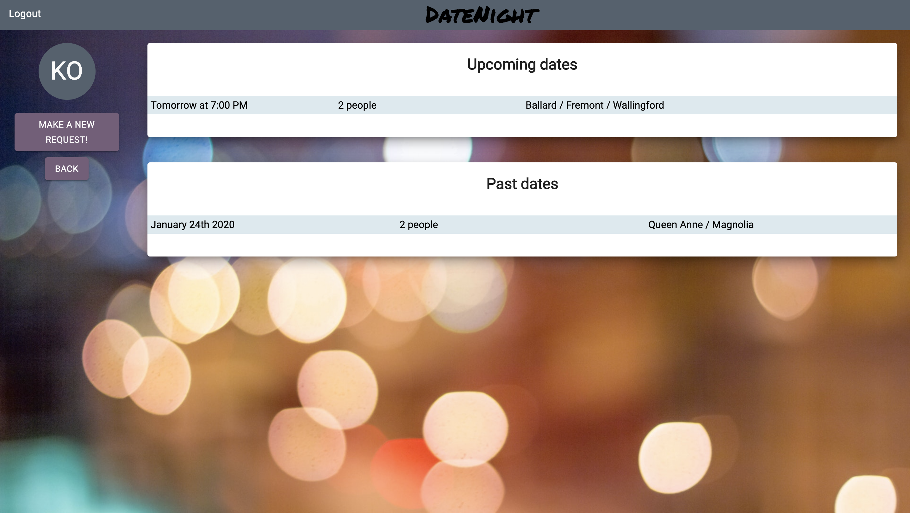
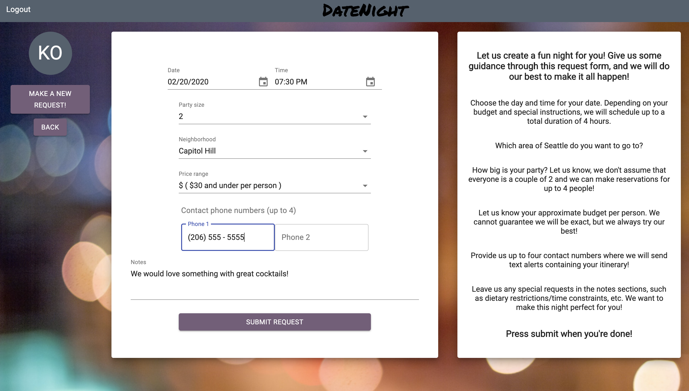
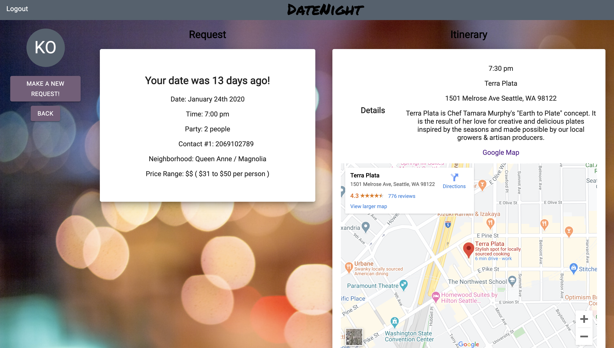

# DateNight

DateNight is a web-based application designed for couples/partners who need some spontaneity when it comes to going out to eat. The app is designed with both user and admin interfaces for full functionality.

## Built With

- React
- Create-React-App
- Devise Token Auth
- Google Maps API
- Twilio API
- Material UI

## Installation

You will need package manager [npm](https://docs.npmjs.com/)

To get a local copy up and running:

1. Clone the repo

```
git clone git@github.com:kara-o/DateNight-frontend.git
```

2. Install NPM packages

```
npm install
```

## Usage

#### As User:

1. Login to your account or create a new one
2. See all of your upcoming dates
3. Review itineraries of past dates and checkout your new itinerary if it is day of your date
4. Make a new date request
5. On day of date, (currently only able to demo) receive text messages that detail your intinerary

#### As Admin:

1. Login to your account
2. See all date requests that need to be fulfilled
3. Choose a request to fulfill
4. Fulfill request by choosing venues through a list of pre-designed packages or a list of individual venues, then confirming reservations through OpenTable
5. Mark as fulfilled

## Roadmap

Lots of plans!

## Screenshots





